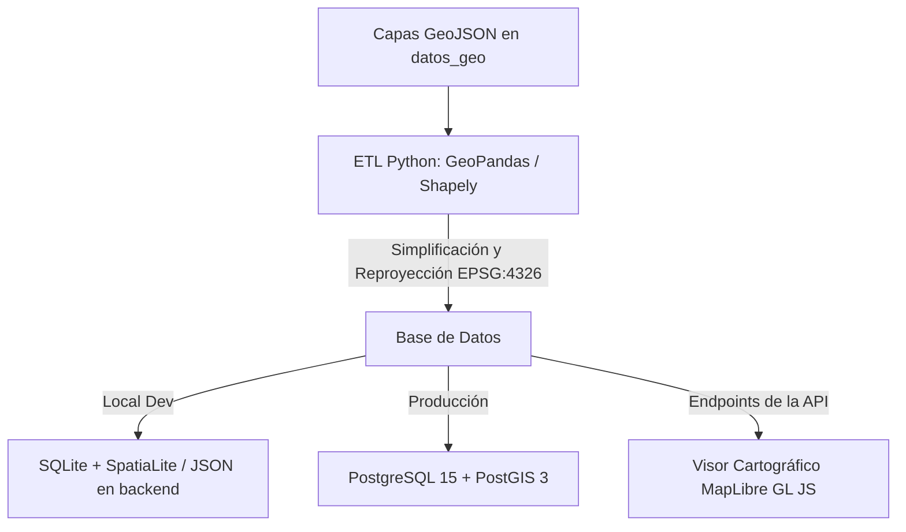

# Guía de Integración y Cruce de Datos Geoespaciales — SIG-UTCUTS Chile

Esta guía detalla cómo utilizar las **12 capas geográficas** que has colocado en la carpeta [datos_geo](file:///c:/web_antigravity/web_D_gemini/sig_utcuts_gwp_chile/insumos/datos_geo) de la plataforma, y qué cruces analíticos se pueden realizar con ellas para alimentar automáticamente la base de datos, el Dashboard Ejecutivo y el Visor Cartográfico interactivo del sitio.

---

## 1. Inventario de Capas Disponibles
En base a los archivos cargados, la plataforma cuenta con el siguiente inventario de capas:

| Archivo | Categoría | Tipo de Geometría | Descripción |
| :--- | :--- | :--- | :--- |
| **`Regional.json`** | Base Territorial | Polígonos | Límites regionales de Chile (16 regiones). |
| **`Provincias.json`** | Base Territorial | Polígonos | División provincial oficial. |
| **`comunas.json`** | Base Territorial | Polígonos | División comunal oficial (unidad base del análisis). |
| **`Ecosistemas_simplified.json`** / **`_multipart.json`** | Climático / Ambiental | Polígonos | Pisos vegetacionales de Chile (Luebert & Pliscoff) y ecosistemas terrestres. |
| **`Areas_Protegidas.json`** | Conservación | Polígonos | SNASPE (Parques Nacionales, Reservas) y áreas protegidas privadas. |
| **`sitios_prior_integrados.json`** | Conservación | Polígonos | Sitios Prioritarios para la Conservación de Biodiversidad (MMA). |
| **`concesion_minera_CONSTITUIDA.json`** | Conflicto / Uso de Suelo | Polígonos | Concesiones mineras vigentes otorgadas por SERNAGEOMIN. |
| **`concesion_minera_EN_TRAMITE.json`** | Conflicto / Uso de Suelo | Polígonos | Pedimentos y manifestaciones de concesiones mineras en trámite. |
| **`Concesiones_Acuicultura_geo.json`** | Conflicto / Uso de Suelo | Polígonos | Concesiones de acuicultura vigentes (SUBPESCA / SERNAPESCA). |
| **`ECMPO_geo.json`** | Gobernanza Social | Polígonos | Espacios Costeros Marinos de Pueblos Originarios (Ley Lafkenche). |

---

## 2. Cómo Utilizar estas Capas en la Plataforma

Para integrar de manera eficiente estas capas (que tienen pesos desde 5MB hasta +80MB), se debe seguir un flujo técnico de dos etapas:



### A. Pre-procesamiento y Optimización (ETL)
Los archivos GeoJSON superiores a 10MB no se deben cargar directamente al frontend, ya que congelarían la pestaña del navegador del usuario. Debes optimizarlos:
1. **Reproyección:** Asegurar que todas las capas estén proyectadas en **`EPSG:4326`** (WGS 84, coordenadas geográficas) para su compatibilidad nativa con MapLibre GL JS y Leaflet.
2. **Simplificación Geométrica:** Utilizar el algoritmo de Douglas-Peucker (mediante GeoPandas en Python) para simplificar la precisión geométrica de las comunas y ecosistemas destinados a visualización general de coropletas, reduciendo el peso de la capa hasta en un **90%** conservando la fidelidad estética.
3. **Conversión a MBTiles / Vector Tiles (Opcional para producción):** Para capas sumamente detalladas como *Concesiones Mineras Constituidas* (+58MB), se recomienda convertirlas a formato Vector Tiles (`.pbf`) usando herramientas como `tippecanoe`.

### B. Carga en la Base de Datos
En producción, estas capas se cargan en el esquema `geo` de la base de datos relacional PostgreSQL con la extensión **PostGIS** habilitada. En desarrollo local, la plataforma corre sobre **SQLite**, donde la geometría se guarda como una columna de texto GeoJSON estructurada o a través de la extensión **SpatiaLite**.

---

## 3. Cruces de Información Estratégicos (Spatial Overlaps)

El verdadero valor de esta información territorial se obtiene al realizar **análisis espaciales cruzados**. A continuación se presentan los **3 principales cruces de información** que alimentarán de forma automatizada las métricas clave de la plataforma:

### Cruce 1: Priorización Territorial Multicriterio (por Comuna)
* **Objetivo:** Calcular automáticamente qué comunas tienen mayor urgencia o potencial para inversiones UTCUTS (Uso de la Tierra, Cambio de Uso de la Tierra y Silvicultura).
* **Análisis Geográfico:**
  - **Superficie de Ecosistemas Vulnerables:** Intersectar `comunas.json` con `Ecosistemas_simplified.json` filtrando por aquellos clasificados como degradados o vulnerables.
  - **Representatividad Ecológica:** Medir el porcentaje de la comuna que está cubierto por áreas protegidas. A menor porcentaje de cobertura en ecosistemas frágiles, mayor es la prioridad de inversión en conservación.
* **Resultado para la Web:** El sistema genera un **Índice de Prioridad de Inversión** por comuna (0 a 100). Comunas de alta vulnerabilidad aparecerán en rojo en el visor, atrayendo la atención de los tomadores de decisión.

```sql
-- Ejemplo de Consulta SQL en PostGIS para calcular porcentaje de bosque/ecosistema por Comuna
SELECT 
    c.cod_comuna,
    c."Comuna",
    SUM(ST_Area(ST_Intersection(c.geom, e.geom)::geography)) / 10000 AS area_ecosistema_ha,
    (SUM(ST_Area(ST_Intersection(c.geom, e.geom))) / ST_Area(c.geom)) * 100 AS porcentaje_cobertura
FROM geo.comunas c
JOIN geo.ecosistemas e ON ST_Intersects(c.geom, e.geom)
GROUP BY c.cod_comuna, c."Comuna";
```

---

### Cruce 2: Filtro de Sinergias y Restricción Reguladora para Proyectos
* **Objetivo:** Al registrar un nuevo proyecto o inversión UTCUTS (por ejemplo, restauración comunitaria de bosque nativo), el sistema determina instantáneamente si califica para financiamiento preferente o si posee trabas legales.
* **Análisis Geográfico:**
  - **Cruce con Áreas Protegidas (`Areas_Protegidas.json`):** Si la geometría de la intervención del proyecto intercepta un parque o reserva nacional, el sistema activa automáticamente un flag de **Sinergia** (apoya planes de manejo del parque) y asigna un indicador MRV de conservación biológica.
  - **Cruce con Sitios Prioritarios (`sitios_prior_integrados.json`):** Si intersecta sitios prioritarios de la biodiversidad, se incrementa su puntuación de elegibilidad en mecanismos financieros como donaciones internacionales (GEF/GCF).

```sql
-- Verificar si un polígono de intervención intercepta un área protegida
SELECT 
    p.id AS proyecto_id,
    p.name AS proyecto_nombre,
    ap.nombre AS area_protegida_nombre,
    ap.categoria AS area_categoria,
    ST_Area(ST_Intersection(p.geom, ap.geom)::geography) / 10000 AS has_traslape
FROM core.interventions p
JOIN geo.areas_protegidas ap ON ST_Intersects(p.geom, ap.geom)
WHERE p.id = :intervention_id;
```

---

### Cruce 3: Semáforo de Conflictos de Uso y Gobernanza Colectiva
* **Objetivo:** Prevenir que se invierta en reforestación o restauración forestal en predios con concesiones industriales activas, o identificar alianzas clave con pueblos originarios.
* **Análisis Geográfico:**
  - **Cruce de Conflictos con Minería (`concesion_minera_CONSTITUIDA.json`):** Si un polígono de reforestación se solapa con una concesión minera constituida, la plataforma genera una alerta de **"Riesgo de Conflicto de Uso del Suelo (Severidad: Alta)"**.
  - **Cruce de Conflictos con Acuicultura (`Concesiones_Acuicultura_geo.json`):** Para proyectos de Carbono Azul (restauración de humedales costeros o algas), interceptar con acuicultura para evitar colisiones operativas.
  - **Gobernanza Indígena (ECMPO - `ECMPO_geo.json`):** Si el proyecto intersecta un Espacio Costero Marino de Pueblos Originarios, el sistema sugiere asociar el proyecto a un mecanismo financiero de co-manejo comunitario y añade metas de impacto socio-cultural.

```sql
-- Alerta temprana de conflictos mineros en la intervención territorial
SELECT 
    i.id AS intervencion_id,
    m.codigo AS codigo_concesion,
    m.nombre AS nombre_concesion,
    m.titular AS titular_concesion,
    ST_Area(ST_Intersection(i.geom, m.geom)::geography) / 10000 AS ha_en_conflicto
FROM core.interventions i
JOIN geo.concesiones_mineras m ON ST_Intersects(i.geom, m.geom)
WHERE m.estado = 'CONSTITUIDA';
```

---

## 4. Alimentación Directa al Frontend (Interfaz Web)

El cruce de esta información geográfica alimenta dinámicamente las pantallas de la plataforma de la siguiente manera:

1. **Dashboard Ejecutivo (Indicadores Clave)**:
   - Muestra estadísticas agregadas a nivel país o región: *"X hectáreas de bosque bajo amenaza minera"*, o *"Y millones de dólares invertidos dentro de Sitios Prioritarios de biodiversidad"*.
2. **Visor Cartográfico (Capas Activables e Interactivas)**:
   - **Control de Capas:** El usuario puede encender/apagar capas como *Áreas Protegidas* u *Oposición Minera* sobre el mapa del proyecto.
   - **Ficha Territorial (Click Callback):** Cuando el usuario hace click en una comuna en el visor cartográfico, el frontend realiza una petición `GET /api/v1/territories/{comuna_id}/geojson`. La base de datos calcula en tiempo real (o recupera valores pre-calculados) los cruces territoriales de esa comuna para mostrar en una ficha contextual:
     - 📌 **Ecosistemas presentes** (% de superficie).
     - 📌 **Traslape minero** (Cantidad de hectáreas concesionadas).
     - 📌 **Áreas protegidas en la comuna** (Porcentaje resguardado).
3. **Módulo de Priorización Multicriterio**:
   - Los pesos que configure el usuario en la interfaz (ej. deslizar más peso a "Presencia de Áreas Protegidas" o "Amenaza Minera") gatillan una petición al backend, la cual pondera espacialmente las capas cargadas para generar una nueva coropleta de color comunal interactiva.
