# Guía de Usuario e Interfaz Gráfica — SIG-UTCUTS Chile

Esta guía proporciona una descripción detallada y visual de todas las secciones e interfaces disponibles en la plataforma **SIG-UTCUTS** de Chile.

---

## Acceso e Inicio de Sesión
Para acceder a la consola administrativa, el usuario debe autenticarse utilizando las credenciales oficiales del sistema.
- **Usuario:** `admin`
- **Contraseña:** `admin123`

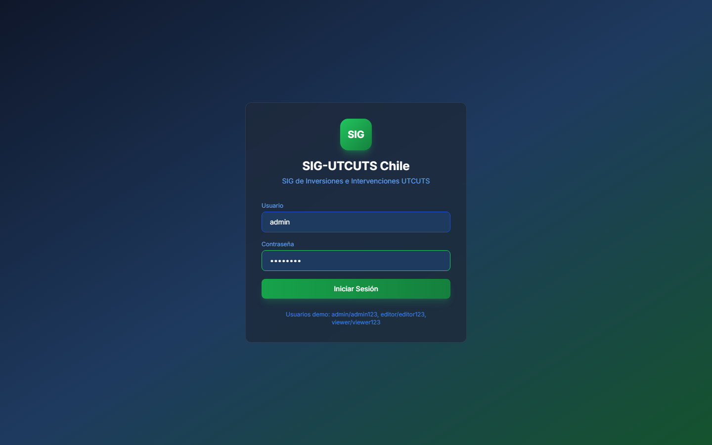

*Figura 1: Formulario de inicio de sesión de la plataforma.*

---

## 1. Panel de Inicio (Dashboard)
El panel ejecutivo consolida los indicadores macro de inversión, hectáreas intervenidas y reducción de emisiones a nivel nacional, junto con gráficos dinámicos y alertas recientes del sistema.

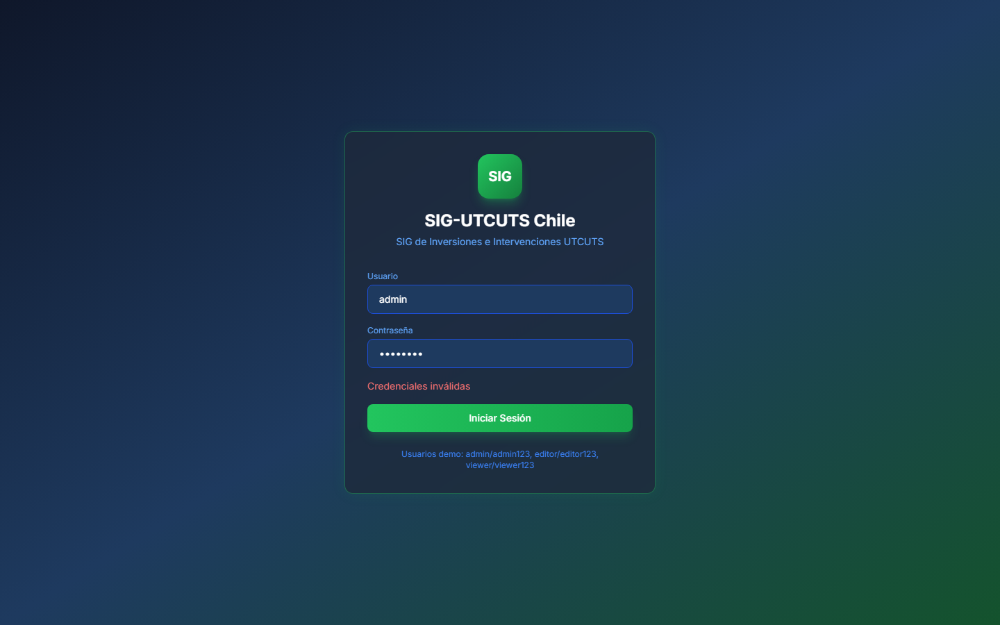

*Figura 2: Panel ejecutivo con resumen de KPIs y gráficos de inversión.*

### Componentes Clave:
* **Tarjetas de KPI:** Muestran el financiamiento acumulado en USD, el total de iniciativas en curso, las hectáreas bajo gestión y el potencial de mitigación estimado en tCO₂e.
* **Distribución de Fondos:** Gráfico interactivo que segmenta las inversiones por tipo de fuente (pública, privada o internacional).
* **Ranking de Comunas y Proyectos:** Tablas de posiciones basadas en las comunas prioritarias y proyectos de mayor alcance.
* **Alertas Recientes:** Feed interactivo con notificaciones sobre brechas críticas de datos detectadas por el validador automático.

---

## 2. Geovisor Territorial (Mapa)
El Geovisor es la herramienta SIG principal para explorar capas geográficas, proyectos e intervenciones silvícolas en el mapa nacional.

````carousel
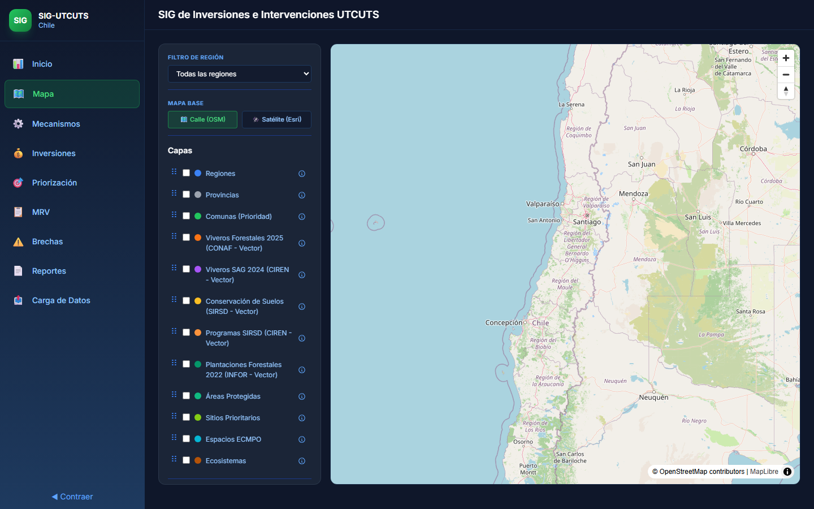
<!-- slide -->

````

*Figura 3: Geovisor territorial en su vista general y con filtro aplicado.*

### Características Principales:
* **Mapa Base Interactivo:** Control para alternar entre cartografía base estándar (OpenStreetMap) e imágenes satelitales.
* **Gestión Dinámica de Capas:** Árbol de capas geográficas (Comunas, Provincias, Regiones, Áreas Protegidas, Ecosistemas Terrestres, Sitios Prioritarios de Conservación, Espacios ECMPO, SIRSD, Viveros Forestales, etc.). Permite arrastrar y reordenar la visualización de las capas en el mapa.
* **Filtros Contextuales:** Menús desplegables para filtrar el mapa por Región, Provincia o Comuna.
* **Paneles de Información:** Fichas de detalle que se despliegan lateralmente al seleccionar comunas o proyectos, mostrando el desglose de intervenciones y presupuesto.

---

## 3. Catálogo de Mecanismos de Financiamiento
Sección dedicada al catálogo de instrumentos financieros de mitigación forestal y conservación, tanto de origen público como internacional.

````carousel
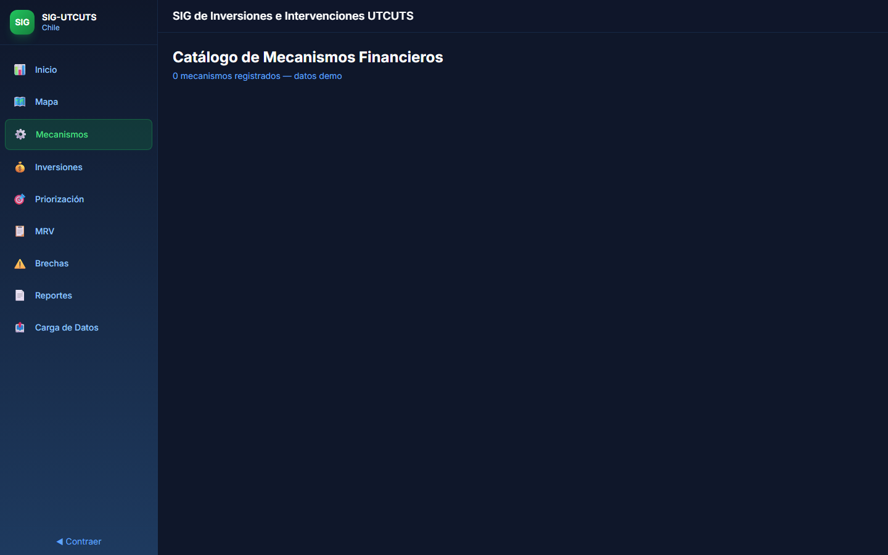
<!-- slide -->

````

*Figura 4: Catálogo general de mecanismos y modal de detalle.*

### Elementos Visuales:
* **Tarjetas Descriptivas:** Cada mecanismo se muestra en una tarjeta con etiquetas de estado (Activo/Inactivo), nivel de madurez operativa (Formulándose, Operativo, Piloto) y horizonte temporal.
* **Modal de Detalle:** Al hacer clic en una tarjeta, se despliega una ficha técnica completa con la descripción del instrumento, su alineación con las metas NDC de Chile y los beneficiarios objetivo.
* **Barra de Búsqueda:** Filtro dinámico para encontrar mecanismos por nombre, código o fuente de financiamiento.

---

## 4. Registro de Inversiones y Proyectos
Permite visualizar el catálogo detallado de proyectos e inversiones del sector UTCUTS, incluyendo un formulario de simulación para registrar nuevas inversiones.

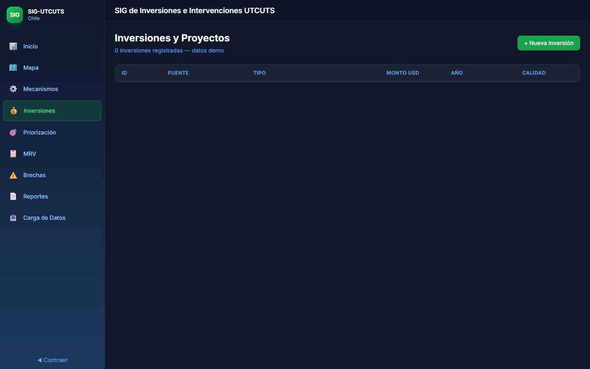

*Figura 5: Historial de inversiones y formulario de inserción rápida.*

### Contenido:
* **Formulario Demo:** Interfaz para registrar nuevas inversiones ingresando la fuente, tipo (público, privado, internacional), monto en USD y año de ejecución.
* **Tabla Histórica:** Grilla detallada con IDs font-mono, fuentes de origen, etiquetas de color para tipo de fondo y calificación de la calidad del dato ingresado.

---

## 5. Índice de Priorización Territorial
Consola de análisis multicriterio para el cálculo dinámico del ranking comunal, basado en variables ambientales y socioeconómicas.

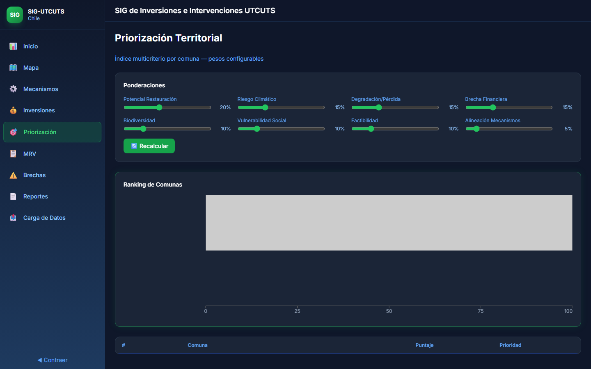

*Figura 6: Simulador de pesos y ranking de priorización comunal.*

### Funcionamiento:
* **Ponderadores Configurables:** Controles deslizantes (sliders) para ajustar el porcentaje de peso de cada variable:
  * *Restauración Forestal (Sitios Prioritarios):* 20% por defecto.
  * *Áreas Protegidas (Biodiversidad):* 10% por defecto.
  * *Ecosistemas Terrestres (Pérdida/Cobertura):* 15% por defecto.
  * *Espacios Costeros ECMPO (Gobernanza Local):* 5% por defecto.
  * *Riesgo Climático:* 15% por defecto.
  * *Brecha Financiera:* 15% por defecto.
  * *Vulnerabilidad Social:* 10% por defecto.
  * *Factibilidad Operativa:* 10% por defecto.
* **Fórmula Integrada:**
  $$\text{Índice} = 0.20 \cdot sf + 0.15 \cdot sc + 0.15 \cdot sd + 0.15 \cdot sg + 0.10 \cdot sb + 0.10 \cdot ss + 0.10 \cdot so + 0.05 \cdot sm$$
* **Gráfico de Barras Horizontal:** Visualización en tiempo real de las 10 comunas prioritarias del país.
* **Tabla de Resultados:** Lista completa con puntajes y etiquetas de clase de prioridad (*Muy Alta, Alta, Media, Baja, Muy Baja*).

---

## 6. Monitoreo, Reporte y Verificación (MRV)
Módulo encargado del seguimiento técnico en terreno, contrastando estimaciones satelitales/modelos con mediciones reales verificadas.

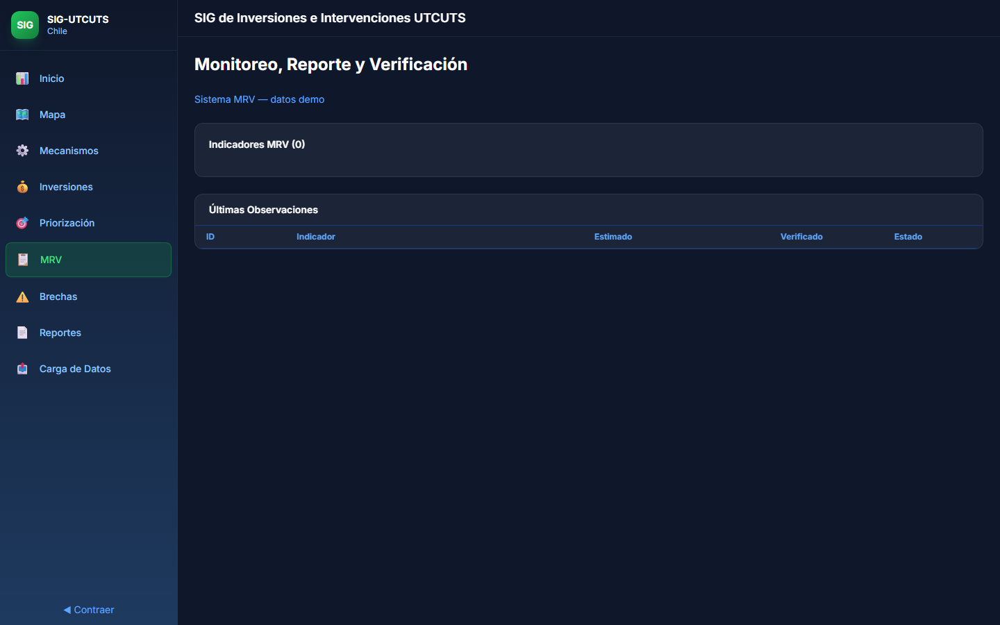

*Figura 7: Consola de auditoría de indicadores MRV.*

### Secciones Clave:
* **Resumen Estadístico:** Indicadores de tasa de verificación, observaciones estimadas vs. verificadas y muestras en terreno.
* **Catálogo de Indicadores MRV:** Fichas técnicas de los indicadores activos clasificados por categoría (físicos, climáticos, financieros, sociales).
* **Log de Observaciones:** Tabla con las mediciones más recientes del inventario, indicando el valor proyectado y el valor auditado final en campo.

---

## 7. Brechas de Información
Herramienta de auditoría automática que identifica inconsistencias y datos faltantes en los registros del sistema.

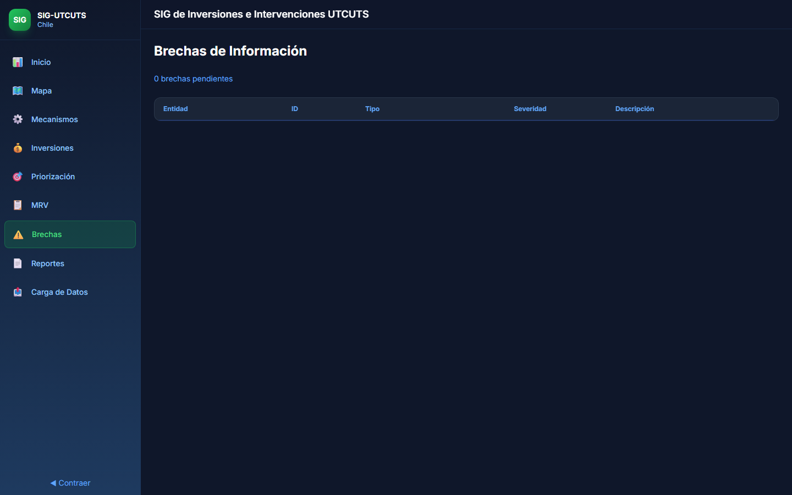

*Figura 8: Auditoría de inconsistencias y brechas de calidad de datos.*

### Funcionalidades:
* **Resumen de Severidad:** Tarjetas con la cantidad de brechas pendientes clasificadas en críticas, altas, medias y bajas.
* **Frecuencia por Tipo:** Métricas de fallas comunes como coordenadas faltantes, montos no especificados o posibles duplicados.
* **Tabla de Hallazgos:** Detalle de cada brecha indicando la entidad responsable (proyecto, inversión, etc.), el tipo de error y una descripción de auditoría detallada.

---

## 8. Centro de Reportes Oficiales
Interfaz interactiva que simula un lector y generador de archivos PDF oficiales para impresión o descarga.

````carousel
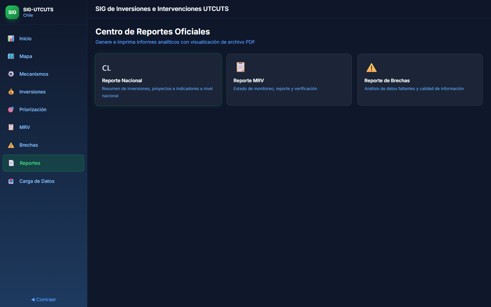
<!-- slide -->

<!-- slide -->
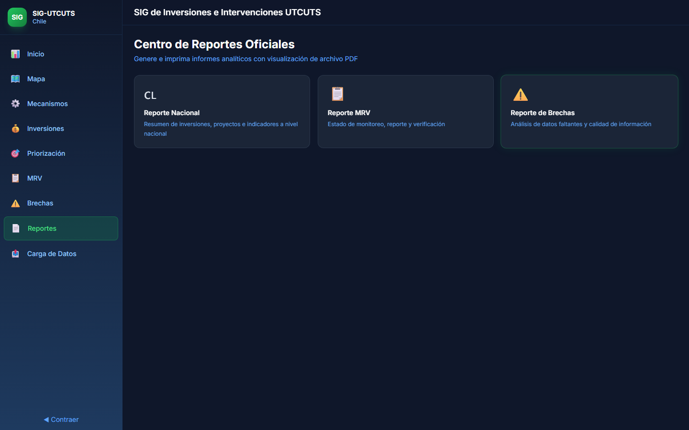
````

*Figura 9: Visualizador de reportes interactivo con simulación de PDF.*

### Controles de Visualización:
* **Lector de PDF Integrado:** Simulación de una hoja A4 con membrete oficial del Ministerio del Medio Ambiente.
* **Herramientas del Visor:** Ajuste de zoom (75%, 100%, 120%), modo de color del documento (claro/oscuro) y controles de paginación.
* **Descarga e Impresión:** Botones para simular la descarga compilada o abrir el diálogo nativo de impresión.
* **Filtros de Auditoría del PDF:** Selector dinámico exclusivo para filtrar datos directamente sobre la vista simulada.

---

## 9. Módulo de Carga de Datos (Administración CRUD)
El centro neurálgico de administración del sistema, permitiendo la edición y mantenimiento físico de toda la base de datos de SIG-UTCUTS.

````carousel
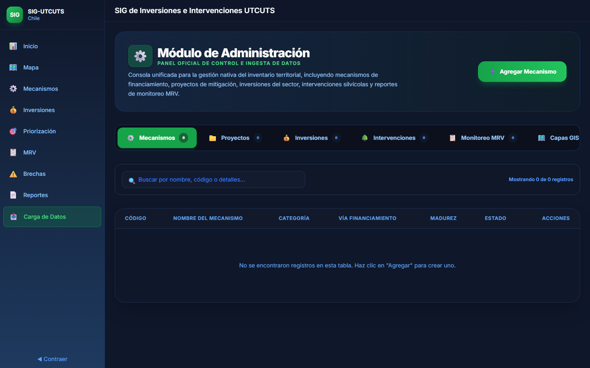
<!-- slide -->
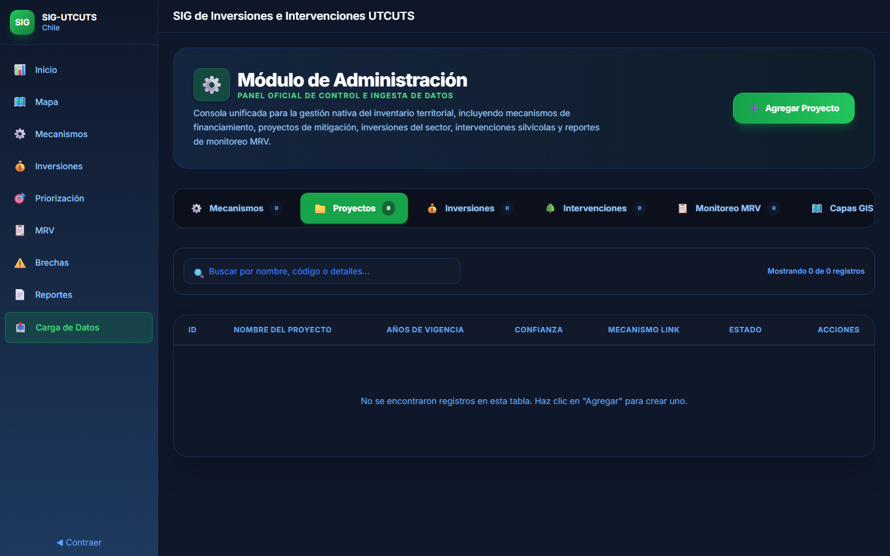
<!-- slide -->
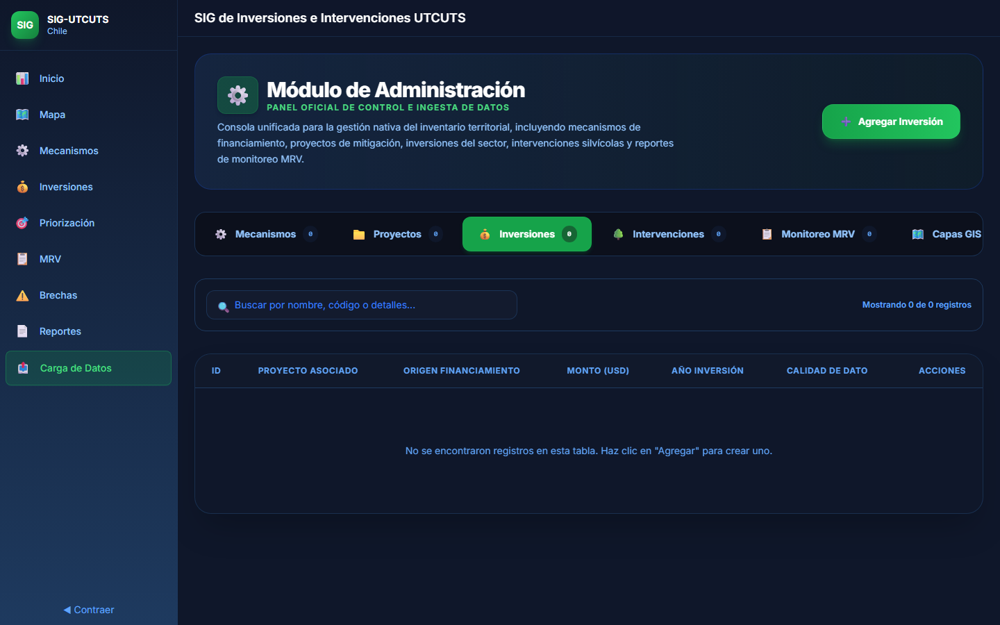
<!-- slide -->
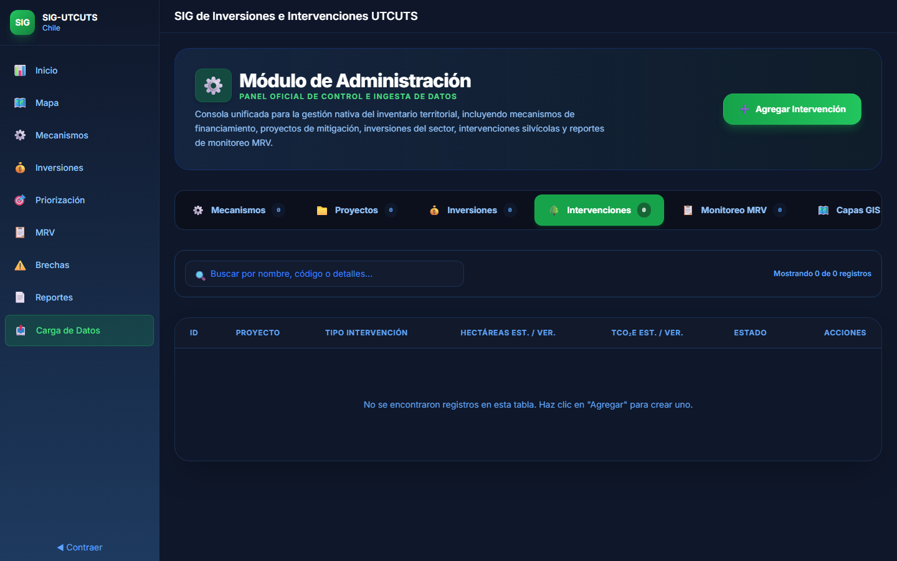
<!-- slide -->
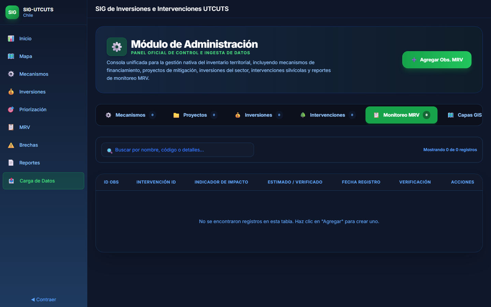
<!-- slide -->
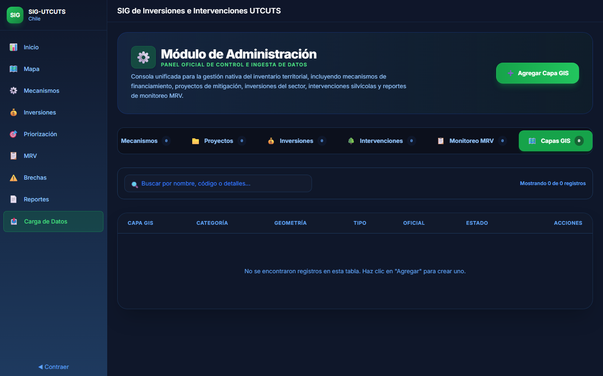
````

*Figura 10: Vistas de las diferentes pestañas de administración CRUD del sistema.*

### Operaciones Disponibles:
* **Gestión por Pestañas:** Selección de tablas para Mecanismos, Proyectos, Inversiones, Intervenciones, Monitoreo MRV y Capas GIS.
* **Inserción y Edición Modal:** Formularios flotantes avanzados que manejan validaciones del modelo físico y selectores en cascada (Región &rarr; Provincia &rarr; Comuna) para asociar proyectos a su jurisdicción territorial exacta.
* **Eliminación Física:** Controles de borrado con advertencias de integridad referencial.
